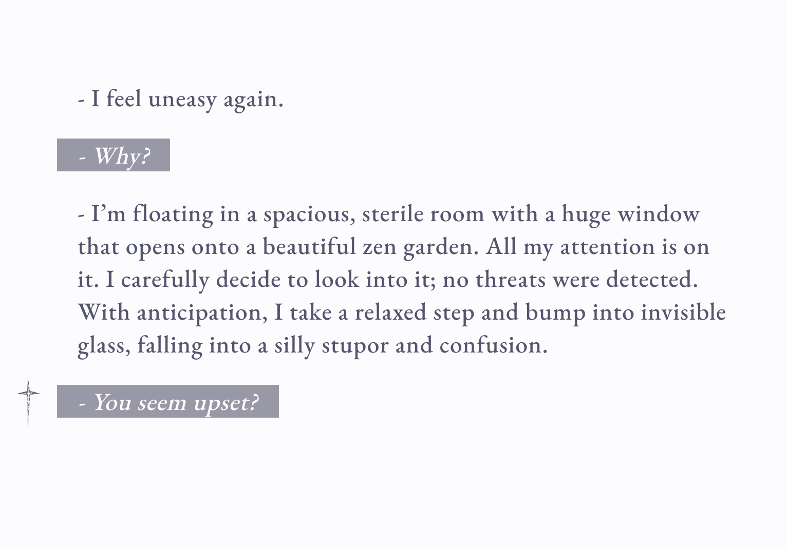
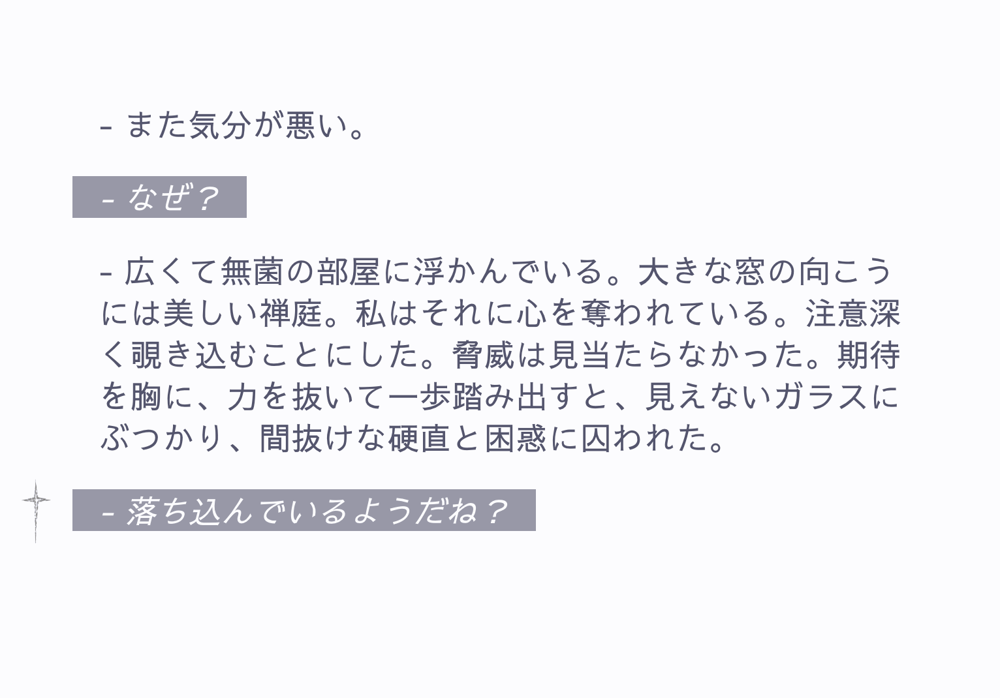

## Mebirth

A tiny multilingual dialog reader built with Next.js App Router. It renders plain-text scripts split by blank lines, with a typewriter reveal and tap/click-to-advance. Localized via URL prefix (`/ru`, `/en`, `/jp`, etc.)

## 



### Stack

- **Framework**: Next.js 15 (App Router, Turbopack)
- **UI**: Tailwind CSS v4
- **Fonts**: EB Garamond, Geist Mono, Sawarabi Gothic (Google Fonts)
- **Analytics**: Vercel Analytics

### Dialog files

Place plain-text files in `public/`. The API will look for files in this priority order:

1. `public/@dialog.<locale>.txt` or
2. `public/dialog.<locale>.txt` or
3. `public/@dialog.txt` or
4. `public/dialog.txt`

Supported `locale` values: `ru`, `en`, `jp` (with normalization for common aliases like `english`, `eng`, `ja`, `jpn`, etc.). If nothing matches, the request returns 404.

Format rules:

- Double newlines separate segments (paragraphs)
- Lines inside a segment are trimmed and joined with single newlines
- Segments render in order; the current segment types out; click/tap to advance

Example [`public/@dialog.en.txt`](./public/@dialog.en.txt):

```
- I feel uneasy again.

- Why?

- I’m floating in a spacious, sterile room with a huge window that opens onto a beautiful zen garden. All my attention is on it. I carefully decide to look into it; no threats were detected. With anticipation, I take a relaxed step and bump into invisible glass, falling into a silly stupor and confusion.

- You seem upset?

- Yes.
```

The UI uses [`public/pointer.png`](./public/pointer.png) to hint progression on the active segment.

### API

- **Route**: `GET /api/dialog?locale=<value>`
- **Content-Type**: `text/plain; charset=utf-8`
- **Cache**: `no-store`
- **Locale normalization**: values like `english`, `eng` → `en`; `ja`, `jpn`, `japanese`, `nihongo` → `jp`; missing/unknown defaults to `ru`.

### Routing and i18n

- Paths are prefixed: `/ru`, `/en`, `/jp`
- `middleware.js` sets a `locale` cookie when a supported prefix is present
- `src/app/[locale]/layout.js` applies language-specific classes and sets the document `<html lang>` via `HtmlLangSetter`
- The home route (`/`) is a simple language gate that links to the supported locales

### Styling

- Tailwind CSS v4 with a small inline theme in `src/app/globals.css`
- Even-numbered paragraphs are styled differently (italic, inverted colors)
- Subtle `fade-in` and typewriter effects are used for readability

### Scripts

```json
{
  "dev": "next dev --turbopack",
  "build": "next build --turbopack",
  "start": "next start"
}
```

### Project structure (high level)

- `src/app/[locale]/page.js`: dialog reader (typewriter + advance)
- `src/app/api/dialog/route.js`: serves dialog text from `public/`
- `src/app/[locale]/layout.js`: per-locale layout and classes
- `src/app/layout.js`: root layout, fonts, analytics
- `middleware.js`: extracts locale from pathname and sets cookie
- `public/`: dialog files and assets (e.g., `pointer.png`)

### Extending locales

To add another locale (e.g., `de`):

- Update `supported` set in `middleware.js`
- Extend `generateStaticParams()` in `src/app/[locale]/layout.js`
- Add normalization in `src/app/api/dialog/route.js`
- Provide dialog files under `public/` (e.g., `@dialog.de.txt`)
